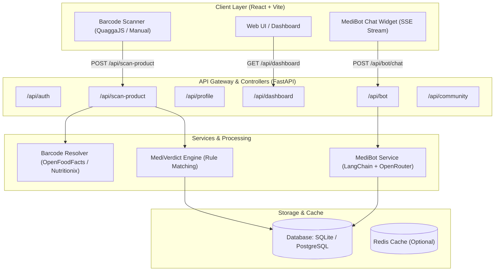
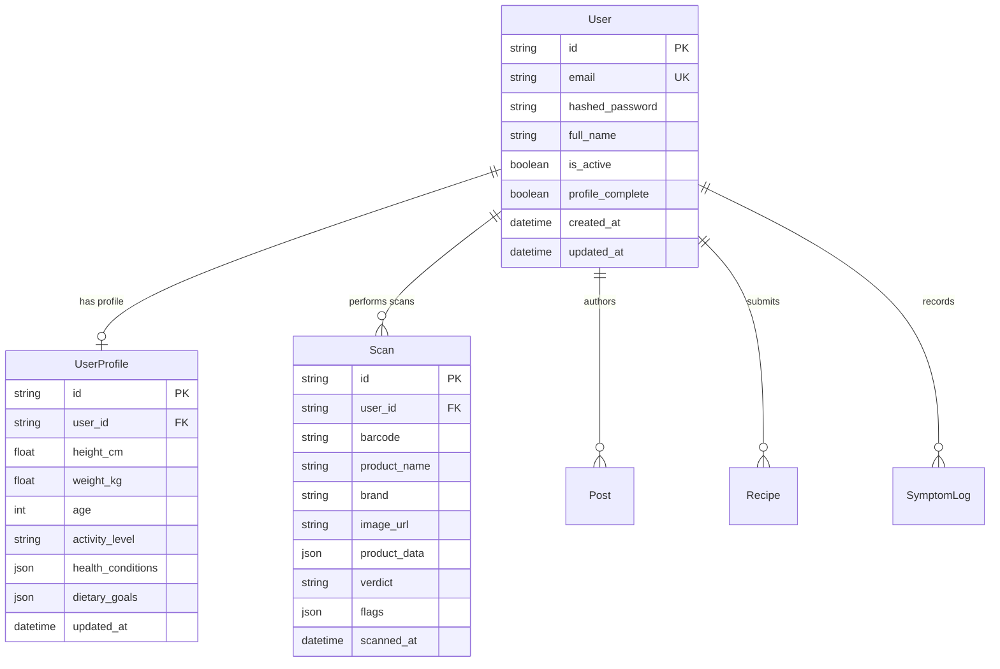

# 🩺 MediScan — Technical Documentation & Architecture Reference

> **Version:** 1.0.0  
> **Status:** Active  
> **Target Audience:** Developers, System Architects, Contributors, Healthcare Tech Evaluators  

---

## 📑 Table of Contents

1. [Executive Summary](#1-executive-summary)
2. [System Architecture](#2-system-architecture)
3. [Technology Stack](#3-technology-stack)
4. [Directory & Repository Structure](#4-directory--repository-structure)
5. [Core Functional Modules](#5-core-functional-modules)
   - [5.1 Product Ingestion & Barcode Service](#51-product-ingestion--barcode-service)
   - [5.2 MediVerdict™ Clinical Rule Engine](#52-mediverdict-clinical-rule-engine)
   - [5.3 MediBot AI Copilot](#53-medibot-ai-copilot)
   - [5.4 Health Profile & Nutrition Analytics](#54-health-profile--nutrition-analytics)
   - [5.5 Community Hub](#55-community-hub)
6. [Data Model & Persistence](#6-data-model--persistence)
7. [API Specification](#7-api-specification)
8. [Configuration & Environment Variables](#8-configuration--environment-variables)
9. [Deployment & Local Setup](#9-deployment--local-setup)
10. [Security, Compliance & Medical Disclaimer](#10-security-compliance--medical-disclaimer)

---

## 1. Executive Summary

**MediScan** is a personalized dietary decision-support platform designed to protect consumers from ingredients and nutritional profiles that conflict with their chronic health conditions, allergies, or dietary restrictions.

By combining computer vision / barcode scanning, real-time product databases (**OpenFoodFacts** and **Nutritionix**), an algorithmic rule engine (**MediVerdict™**), and large language model reasoning (**MediBot**), MediScan converts complex product packaging labels into clear, actionable, and personalized **SAFE**, **CAUTION**, or **DANGER** assessments.

### Key Objectives
- **Error Reduction**: Eliminate human error in decoding complex ingredient nomenclature (e.g., casein, maltodextrin, high-fructose corn syrup, nitrates).
- **Zero Latency Feedback**: Deliver rule-based health classification within milliseconds of scanning.
- **Contextual Health Guidance**: Provide contextual LLM-driven answers grounded strictly in the user's specific health record and the scanned product's verified nutrient breakdown.

---

## 2. System Architecture

MediScan follows a modern decoupled client-server architecture:



### End-to-End Scan & Verdict Data Flow

```mermaid
sequenceDiagram
    autonumber
    actor User as User / Camera
    participant FE as Frontend (React)
    participant BE as Backend (FastAPI)
    participant OFF as OpenFoodFacts API
    participant Engine as MediVerdict Engine
    participant DB as Database (SQLite/Postgres)

    User->>FE: Scans Barcode or enters UPC
    FE->>BE: POST /api/scan-product { barcode }
    BE->>OFF: Fetch Product Metadata & Nutriments
    OFF-->>BE: Normalized Product JSON
    BE->>DB: Query User Health Profile (conditions, allergies)
    DB-->>BE: User Conditions List
    BE->>Engine: compute_verdict(product, conditions)
    Engine-->>BE: { verdict: "SAFE" | "CAUTION" | "DANGER", flags: [...] }
    BE->>DB: Persist Scan Record (history, flags, timestamp)
    BE-->>FE: Return Product, Verdict, Flag Summaries
    FE-->>User: Render Colored Badge & Specific Health Warnings
```

---

## 3. Technology Stack

| Layer | Technology | Version | Purpose |
| :--- | :--- | :--- | :--- |
| **Frontend Framework** | React | `^18.2` | Single Page Application UI |
| **Bundler & Tooling** | Vite | `^5.1` | Ultra-fast HMR and production bundling |
| **Styling & Icons** | Tailwind CSS + Lucide React | `^3.4` / `^0.35` | Responsive utility-first design & medical icons |
| **State Management** | Zustand | `^4.5` | Global auth and persistent session state |
| **Backend Framework** | FastAPI | `^0.110` | High-throughput asynchronous REST API |
| **ASGI Web Server** | Uvicorn (Standard) | `^0.28` | Production asynchronous HTTP / SSE server |
| **ORM / Database Engine**| SQLAlchemy (asyncio) | `^2.0` | Asynchronous database modeling and query execution |
| **Drivers** | aiosqlite / asyncpg | Latest | Non-blocking database connectors |
| **Validation & Schema** | Pydantic v2 | `^2.6` | Strict runtime typing and data serialization |
| **AI / LLM Integration** | LangChain Core / OpenAI | Latest | Context-augmented prompt construction & streaming |
| **Authentication** | python-jose & passlib (bcrypt)| Latest | Cryptographically signed JWT tokens and password hashing |

---

## 4. Directory & Repository Structure

```
mediscan/
├── backend/
│   ├── app/
│   │   ├── api/                  # REST route controllers
│   │   │   ├── auth.py           # Registration, login, JWT validation
│   │   │   ├── bot.py            # MediBot chat & streaming SSE endpoints
│   │   │   ├── community.py      # Discussion forum, recipes, symptom logs
│   │   │   ├── dashboard.py      # Aggregated metrics, alerts, weekly charts
│   │   │   ├── profile.py        # Health profile management & condition tags
│   │   │   └── scanner.py        # Product scanning & history retrieval
│   │   ├── models/               # SQLAlchemy ORM database schemas
│   │   │   ├── community.py      # Post, Recipe, SymptomLog entities
│   │   │   ├── profile.py        # UserProfile & medical metadata
│   │   │   ├── scan.py           # Historical Scan records and flags
│   │   │   └── user.py           # User accounts & auth credentials
│   │   ├── services/             # Core business and algorithmic logic
│   │   │   ├── barcode_service.py # Ingestion & normalization from OpenFoodFacts
│   │   │   ├── bot_service.py     # LangChain streaming LLM service
│   │   │   └── verdict_engine.py  # MediVerdict deterministic rule processor
│   │   ├── config.py             # Pydantic Settings configuration loader
│   │   ├── database.py           # Async DB engine & session generators
│   │   └── main.py               # FastAPI application lifecycle & middleware
│   ├── requirements.txt          # Python dependency manifest
│   └── Dockerfile                # Container build recipe
├── frontend/
│   ├── src/
│   │   ├── api/client.js         # Centralized Axios client with JWT interceptors
│   │   ├── components/           # Reusable UI widgets
│   │   │   ├── MediBot.jsx       # Floating AI chat window with streaming
│   │   │   ├── MediVerdict.jsx   # Visual badge indicator (Safe/Caution/Danger)
│   │   │   ├── Navbar.jsx        # Navigation bar with user status
│   │   │   └── NutritionCard.jsx # Formatted nutrition facts panel
│   │   ├── pages/                # Application view controllers
│   │   │   ├── Community.jsx     # Social recipes, experiences, and warnings
│   │   │   ├── Dashboard.jsx     # Aggregated safety metrics & alerts log
│   │   │   ├── Landing.jsx       # Marketing & value proposition landing page
│   │   │   ├── Login.jsx         # User authentication view
│   │   │   ├── ProfileSetup.jsx  # Health conditions & biometrics onboarding
│   │   │   ├── Register.jsx      # New user account creation
│   │   │   └── Scanner.jsx       # Barcode scanner and live verdict inspector
│   │   ├── store/useStore.js     # Zustand persistent reactive state
│   │   ├── App.jsx               # Client-side router configuration
│   │   └── main.jsx              # React DOM mounting entry point
│   ├── package.json              # NPM dependencies & scripts
│   └── vite.config.js            # Vite bundler configuration
├── docker-compose.yml            # Multi-container orchestration (PG, Redis, App)
├── run_servers.bat               # Windows single-click development launcher
└── README.md                     # Quickstart documentation
```

---

## 5. Core Functional Modules

### 5.1 Product Ingestion & Barcode Service
*File: `backend/app/services/barcode_service.py`*

The barcode ingestion module adopts a multi-tiered lookup strategy:
1. **Primary Provider (OpenFoodFacts API v2)**: Free, open database without mandatory API key restrictions. Retrieves ingredients, nutriscore, nutriments per 100g, and allergen tags.
2. **Fallback Provider (Nutritionix Track API)**: Activated automatically if OpenFoodFacts returns no match and API credentials exist.
3. **Data Normalization Layer**: Regardless of source, output is strictly mapped to a normalized dictionary schema:
   - `barcode`: Standard UPC/EAN code string.
   - `product_name`, `brand`, `image_url`
   - `ingredients_text`: Normalized full ingredients list.
   - `nutrient_levels`: Unified dictionary with normalized units (`sodium_100g` converted to mg; fats, carbs, sugars, fibers in grams).

### 5.2 MediVerdict™ Clinical Rule Engine
*File: `backend/app/services/verdict_engine.py`*

The verdict engine evaluates parsed food attributes against rule arrays tied to clinical conditions.

#### Supported Conditions & Evaluation Criteria

| Clinical Condition | Rule Type | Threshold / Keywords | Trigger Reason |
| :--- | :--- | :--- | :--- |
| **Type 1 Diabetes** | Nutrient | Sugars > `5.0g` / Carbs > `20.0g` per 100g | High Sugar / High Carbohydrates |
| **Type 2 Diabetes** | Nutrient | Sugars > `5.0g` / Carbs > `20.0g` per 100g | High Sugar / High Carbohydrates |
| **Hypertension** | Nutrient | Sodium > `120mg` per 100g | High Sodium |
| **High Cholesterol** | Nutrient | Saturated Fat > `2.0g` / Trans Fat > `0.0g` per 100g | High Saturated Fat / Contains Trans Fat |
| **Chronic Kidney Disease (CKD)** | Nutrient | Potassium > `200mg` / Phosphorus > `100mg` / Protein > `10g` per 100g | High Potassium, Phosphorus, or Protein |
| **Celiac Disease** | Ingredient | `wheat`, `gluten`, `barley`, `rye`, `spelt`, `triticale` | Contains Gluten (Hard Danger) |
| **Nut Allergy** | Ingredient | `peanut`, `almond`, `walnut`, `cashew`, `hazelnut`, `pecan`, `pistachio`, `macadamia`, `brazil nut` | Contains Nuts (Hard Danger) |
| **Dairy Allergy** | Ingredient | `milk`, `lactose`, `casein`, `whey`, `butter`, `cream`, `cheese`, `yogurt`, `ghee` | Contains Dairy (Hard Danger) |
| **IBS / FODMAP Sensitivity** | Ingredient | `fructose`, `sorbitol`, `mannitol`, `xylitol`, `inulin`, `chicory root`, `apple juice concentrate` | High FODMAP Ingredients |

#### Verdict Resolution Matrix
- **`DANGER`**: Triggered if any **Hard Danger** label matches (e.g. allergens for diagnosed allergies, gluten for Celiac) OR if total flags $\ge 3$.
- **`CAUTION`**: Triggered if $1 \le \text{total flags} < 3$ without hard danger labels.
- **`SAFE`**: Triggered when $\text{total flags} = 0$.

### 5.3 MediBot AI Copilot
*File: `backend/app/services/bot_service.py`*

MediBot is an integrated LLM assistant powered by LangChain and OpenRouter.
- **Context Injection**: Every prompt dynamically embeds:
  - User's age, weight, height, activity level, and list of health conditions.
  - Currently viewed product's name, brand, ingredients, nutrient values per 100g, and MediVerdict status.
- **Streaming Response**: Employs Server-Sent Events (SSE) via FastAPI's `StreamingResponse`, feeding tokens in real-time to [`MediBot.jsx`](file:///c:/Users/asus/Desktop/mediscan/scanit/mediscan/frontend/src/components/MediBot.jsx).
- **Guardrails**: System instructions forbid issuing definitive medical diagnoses and require recommending qualified clinical consultation for medical uncertainties.

### 5.4 Health Profile & Nutrition Analytics
*File: `backend/app/api/profile.py`, `backend/app/api/dashboard.py`*

- **Profile Ingestion**: Captures biometrics, activity level, and multi-select condition tags during user onboarding.
- **Historical Aggregation**: Analyzes past scans to compile danger-level breakdowns, nutrient trend flags, and frequent offender ingredients.

### 5.5 Community Hub
*File: `backend/app/api/community.py`*

- Enables authenticated users to share verified safe product alternatives.
- Supports sharing allergen-friendly recipes and logging adverse symptom experiences tied to specific food categories.

---

## 6. Data Model & Persistence

The relational schema is managed through SQLAlchemy ORM mapped classes:



---

## 7. API Specification

All protected endpoints require an `Authorization: Bearer <JWT_TOKEN>` header.

### Authentication Endpoints (`/api/auth`)
- `POST /api/auth/register` — Create new user account with email & password.
- `POST /api/auth/login` — Authenticate and receive access & refresh JWT tokens.
- `GET /api/auth/me` — Retrieve current authenticated user profile state.

### Scanner & Product Endpoints (`/api`)
- `POST /api/scan-product`
  - **Body:** `{ "barcode": "737628064502" }`
  - **Action:** Resolves barcode, evaluates user profile, creates history record.
  - **Returns:** `{ scan_id, product, verdict, flags, alert_summaries }`
- `GET /api/scan-product/{barcode}`
  - Cached lookup without writing to scan history table.
- `GET /api/scans/history?page=1&per_page=20`
  - Returns paginated scan history for the current user.

### Health Profile Endpoints (`/api/profile`)
- `GET /api/profile` — Fetch active user profile and condition lists.
- `PUT /api/profile` — Upsert user profile (height, weight, age, `health_conditions` array).

### MediBot AI Assistant (`/api/bot`)
- `POST /api/bot/chat`
  - **Body:** `{ "message": str, "product_context": dict, "chat_history": list }`
  - **Returns:** `text/event-stream` Server-Sent Event stream of token chunks.

### Dashboard & Analytics (`/api/dashboard`)
- `GET /api/dashboard/stats` — Summary counts (total scans, safe/caution/danger count).
- `GET /api/dashboard/recent-alerts` — List of high-priority flagged ingredients and nutrients.

---

## 8. Configuration & Environment Variables

System settings are managed via Pydantic in [`config.py`](file:///c:/Users/asus/Desktop/mediscan/scanit/mediscan/backend/app/config.py) using `.env`:

| Variable | Type | Default Value | Description |
| :--- | :--- | :--- | :--- |
| `DATABASE_URL` | String | `sqlite+aiosqlite:///./mediscan.db` | SQLAlchemy async database connection URI |
| `SECRET_KEY` | String | `mediscan-dev-secret...` | Cryptographic secret for signing JWT tokens |
| `ALGORITHM` | String | `HS256` | JWT signing algorithm |
| `ACCESS_TOKEN_EXPIRE_MINUTES`| Int | `60` | Lifespan of access token in minutes |
| `REFRESH_TOKEN_EXPIRE_DAYS` | Int | `7` | Lifespan of refresh token in days |
| `OPENROUTER_API_KEY` | String | `""` (Empty) | API key for MediBot LLM reasoning |
| `OPENROUTER_MODEL` | String | `openai/gpt-4o-mini` | Model slug to dispatch queries to |
| `NUTRITIONIX_APP_ID` | String | `""` (Optional) | Nutritionix application identifier |
| `NUTRITIONIX_API_KEY` | String | `""` (Optional) | Nutritionix developer API key |
| `CORS_ORIGINS` | List | `["http://localhost:5173", ...]` | Allowed Cross-Origin Resource Sharing origins |

---

## 9. Deployment & Local Setup

### Option A: Local Development (Windows / macOS / Linux)

#### 1. Backend Setup
```bash
cd backend
python -m venv venv
# Windows:
venv\Scripts\activate
# Linux/macOS:
source venv/bin/activate

pip install -r requirements.txt
python -m uvicorn app.main:app --reload --port 8000
```
*API docs available at: `http://localhost:8000/docs`*

#### 2. Frontend Setup
```bash
cd frontend
npm install
npm run dev
```
*Web application available at: `http://localhost:5173`*

#### 3. Single-Click Script (Windows)
Execute [`run_servers.bat`](file:///c:/Users/asus/Desktop/mediscan/scanit/mediscan/run_servers.bat) from the `mediscan` directory to launch both frontend and backend automatically.

---

### Option B: Docker Container Deployment

MediScan includes an automated multi-stage `docker-compose.yml` configuring PostgreSQL, Redis, FastAPI, and Vite:

```bash
docker-compose up --build
```

---

## 10. Security, Compliance & Medical Disclaimer

### Security & Privacy
- Passwords are salted and hashed with **bcrypt**; raw passwords are never persisted.
- Stateless authentication uses short-lived **JWT tokens**.
- API input structures are validated through **Pydantic schemas** to prevent injection vectors.

> [!CAUTION]
> ### Medical Disclaimer
> MediScan and the MediVerdict™ engine are designed strictly for **informational, educational, and preliminary dietary awareness purposes**. They do not constitute formal medical diagnosis, treatment recommendations, or emergency allergy management. Users must consult registered dietitians or healthcare professionals for chronic medical conditions or severe, life-threatening anaphylactic food allergies. Product formulations may change at the manufacturer's discretion without notice.

